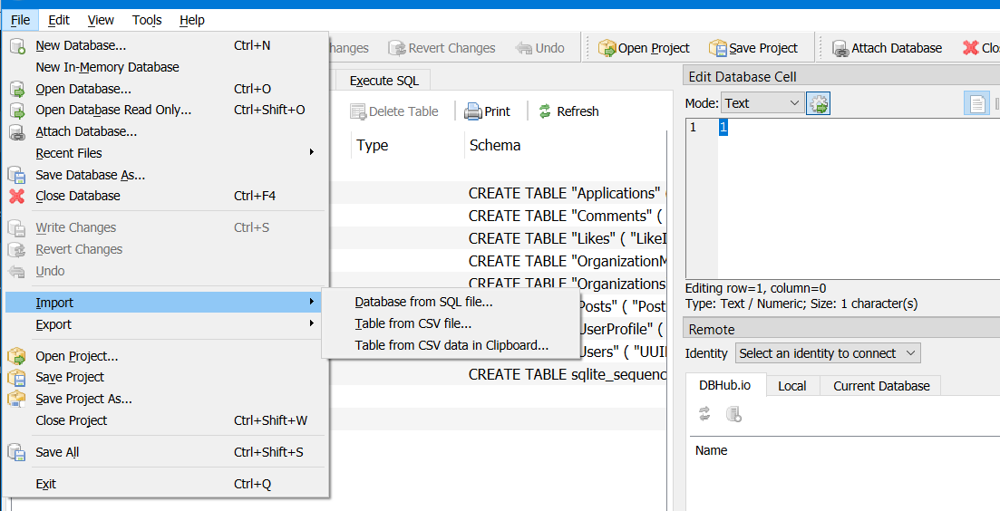

# Advanced Software Engineering Mini-Project

## Table of Contents

-   [Advanced Software Engineering Mini-Project](#advanced-software-engineering-mini-project)
    -   [Table of Contents](#table-of-contents)
    -   [Project Overview](#project-overview)
    -   [Project Artifacts](#project-artifacts)
        -   [Figma](#figma)
        -   [Requirements \& Architectural Design](#requirements--architectural-design)
        -   [Test Document](#test-document)
    -   [Getting Started](#getting-started)
        -   [Prerequisites](#prerequisites)
        -   [Backend Setup](#backend-setup)
        -   [Frontend Setup](#frontend-setup)
        -   [Reverse Proxy Setup](#reverse-proxy-setup)
    -   [Running the Application](#running-the-application)
    -   [Project Members](#project-members)

## Project Overview

This mini-project is developed for the **6121 - Advanced Software Engineering** course. It comprises a backend (BE) built with [Python](https://www.python.org/) ([FastAPI](https://fastapi.tiangolo.com/)), a frontend (FE) served via a simple [Python HTTP server](https://docs.python.org/3/library/http.server.html) and [Bootstrap](https://getbootstrap.com/), and a reverse proxy managed by [Caddy](https://caddyserver.com/). The application facilitates seamless interaction between the frontend and backend services through the reverse proxy.

## Project Artifacts

### Figma

The following is a link to the Figma project for this mini-project:
[https://www.figma.com/community/file/1424288168204247330/ea-connect](https://www.figma.com/community/file/1424288168204247330/ea-connect)

### Requirements & Architectural Design

This document is available in the [DOCS/document/main.pdf](DOCS/document/main.pdf) file.

### Test Document

Test document is available on Google Sheets in the following link: [https://docs.google.com/spreadsheets/d/1XZu6DYD6e8Knkeral-qCdYQEnJbHb0gEoDl1YMwDkMk/edit?usp=sharing](https://docs.google.com/spreadsheets/d/1XZu6DYD6e8Knkeral-qCdYQEnJbHb0gEoDl1YMwDkMk/edit?usp=sharing)

## Getting Started

### Prerequisites

Before you begin, ensure you have the following installed on your machine:

-   **Python 3.10+**: [Download Python](https://www.python.org/downloads/)
-   **pip**: Comes with Python, but ensure it's up to date.
-   **Caddy**: [Install Caddy](https://caddyserver.com/docs/install)

### Backend Setup

Before running BE, you need to create a sqlite database in the `BE/data` directory named `db.sqlite3` first. This can be achieved by running using the Import function in the [DB Browser for SQLite](https://sqlitebrowser.org/) with [BE/src/schema.sql](BE/src/schema.sql) and then saving the database.



1. **Navigate to the Backend Directory:**

    ```bash
    cd BE
    ```

2. **Create a Python Virtual Environment:**

    ```bash
    python -m venv venv
    ```

3. **Activate the Virtual Environment:**

    - **On Windows:**
        ```bash
        venv\Scripts\activate
        ```
    - **On macOS/Linux:**
        ```bash
        source venv/bin/activate
        ```

4. **Install Required Dependencies:**

    ```bash
    pip install -r requirements.txt
    ```

5. **Run the Backend Server:**
    ```bash
    uvicorn main:app --host 127.0.0.1 --port 3013
    ```

### Frontend Setup

1. **Navigate to the Frontend Directory:**

    ```bash
    cd FE
    ```

2. **Start the Frontend Server:**
    ```bash
    python -m http.server 3014 --bind 127.0.0.1
    ```

### Reverse Proxy Setup

1. **Ensure Caddy is Installed:**
   If not installed, follow the [Caddy installation guide](https://caddyserver.com/docs/install).

2. **Run the Reverse Proxy:**

    ```bash
    caddy run
    ```

    _Note: Ensure that your `Caddyfile` is properly configured to route traffic to the backend and frontend services._

## Running the Application

Once all services are up and running:

1. **Access the Application:**
   Open your web browser and navigate to:

    ```
    http://{host_machine_ip}:3012
    ```

    Replace `{host_machine_ip}` with the IP address of the machine hosting the application.

2. Enjoy!

## Project Members

The below table shows the project members and their **main** roles (i.e. each member does not do one task, but can do multiple tasks).
| Name | ID | Role |
| -------------------- | -------- | ---------------- |
| Nguyen Vu Binh Duong | 23025102 | Developer |
| Do Thi Hong Van | 23025110 | Tester |
| Pham Hoang Phi | 23025106 | Product Owner |
| Nguyen Trong Dat | 24025033 | Business Analyst |

---

**Course:** 6121 - Advanced Software Engineering  
**Semester:** Fall 2024
